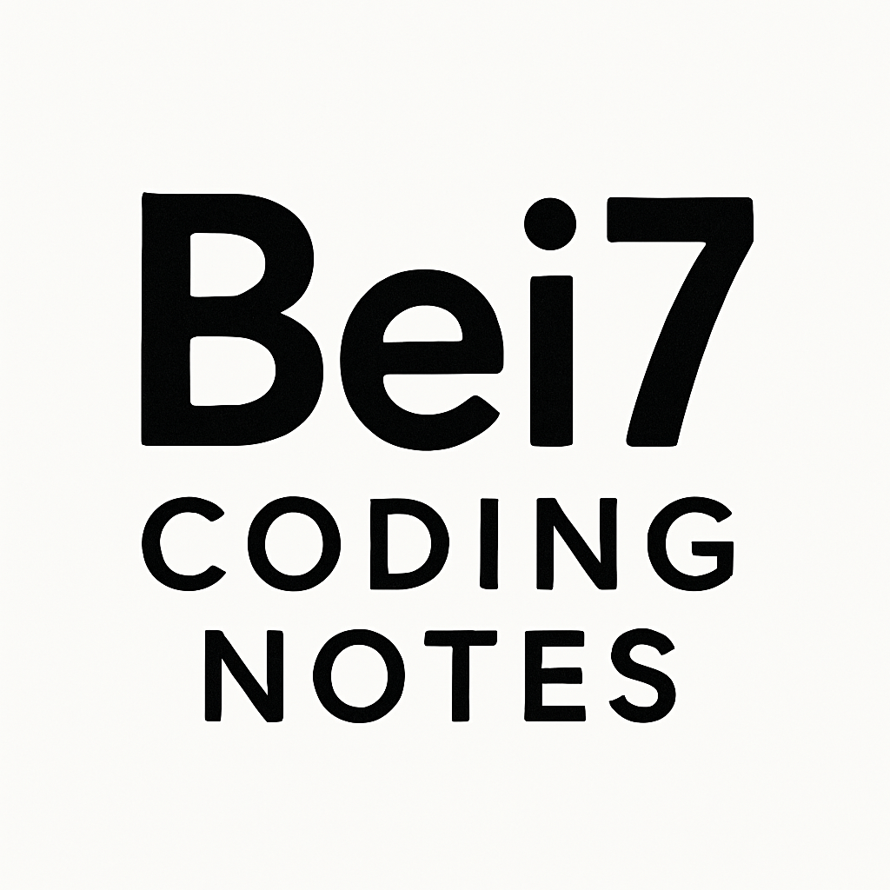
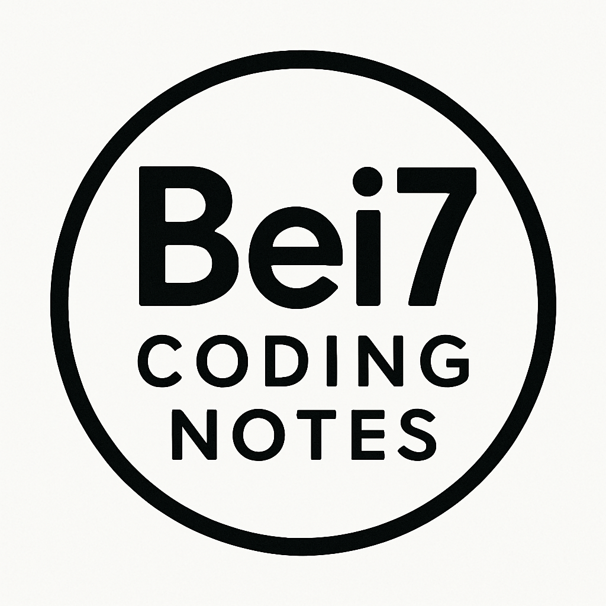
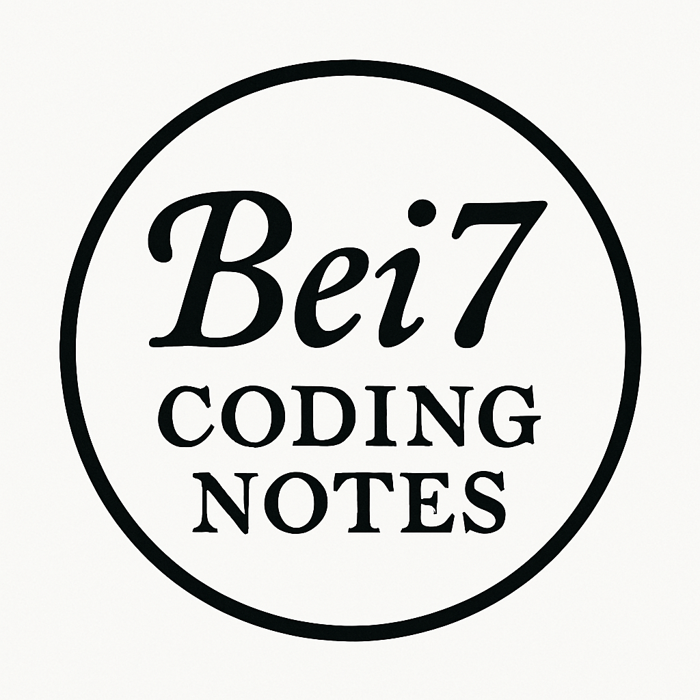
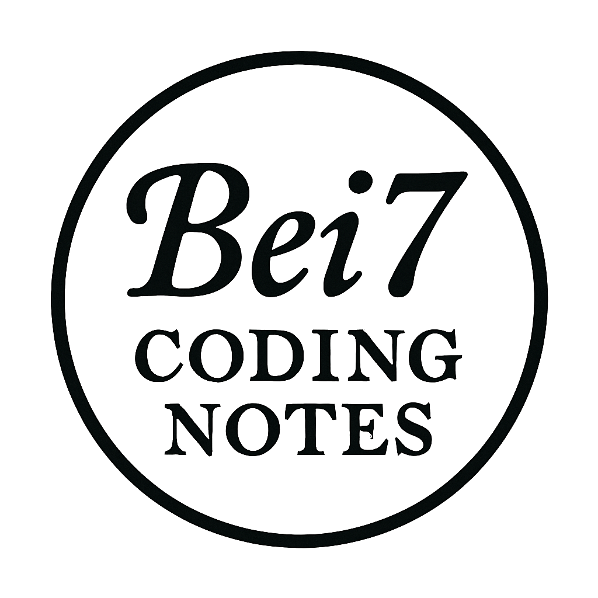

# 製作Logo

一個網站重要的就是Logo嘛！  
現在AI盛行，我又不會畫圖、弄插畫  
我只好求助ChatGPT了。  
<!--more-->
不過日前我還是免費仔  
我簡單生幾張圖  
和我下的prompt好了 哈哈

----
因為是使用免費版的，所以沒有特別設定LLM Model了  
##### 這個是我下的第一個prompt
```text
幫我製作一個logo icon
我要放到mkdoc logo
這個網站主要是部落格及技術分享
部落個名稱是Bei7's Coding Notes
所以核心要有 Bei7
我希望它是 扁平化 簡單
顏色希望有黑白相間，但藝術氣質高一點，不要直接給我文字貼上
建議圖片尺寸為 32x32 或 64x64 像素，格式可以是 PNG、SVG 等。
```


因為下Prompt太簡略嗎？  
還是什麼原因，結果出來一個大大的英文。  
不過只是簡易的Logo而已  
就不管太多了  
簡單就好吧！
---
##### 這個是我下的第二個prompt
```text
裡面要是圓形
且順時針排序
```


確實是變圓型的了。  
但字沒有跟著圓圈外圍繞順時針排序  
看來Prompt下的太差了
但我也沒要求太多
改個字體就好吧！
---
##### 這個是我下的第三個prompt
```text
字體我希望類似這個 "𝒻𝒶𝓃𝒸𝓎 𝓉𝑒𝓍𝓉"
```

上網隨便找了個字體  
不過看起來還行  
夠簡單  
但跟想像中的果然有點差距  
不過我的藝術細胞果然太低  
我竟然對這種Logo，也無法想到什麼反駁話語  
那就將這個當作我的Logo吧！
我也對過於浮誇或設計感重的Logo  
沒有太多感覺，畢竟沒什麼藝術天分呢！
哈哈哈

---

最後在使用[Photopea](https://www.photopea.com/) 將它去背  
就大功告成啦！！  

好啦！今天就先這樣吧！
做了平常不會做的事！  
好累XD
---
##### 這裡是廣告
<div class="ad-container" id="about"></div> <!-- 廣告容器 -->